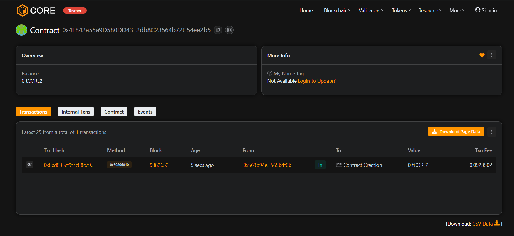

# 🌐  HashMatrix

## 📘 Project Description
BlockWeaveNet is a decentralized network management system built on Ethereum blockchain.  
It allows users to add, view, and update nodes on a transparent and immutable ledger.

---

## 🌍 Project Vision
To provide a tamper-proof and scalable blockchain framework for managing distributed nodes securely and efficiently.

---

## ✨ Key Features
- Add nodes with timestamp and owner information  
- Retrieve node details transparently  
- Owner-only node updates for secure management  

---

## 🚀 Future Scope
- Integrate IPFS for off-chain node data storage  
- Build a visualization dashboard for nodes  
- Implement DAO-based governance for node updates  
- Cross-chain interoperability for decentralized networks  

---

## 🧩 Tech Stack
- Solidity for Smart Contract Development  
- Hardhat for Testing & Deployment  
- JavaScript for Scripts  
- Ethereum / Sepolia Testnet for Deployment  

Contract Details :0x4F842a55a9D580DD43F2db8C23564b72C54ee2b5

